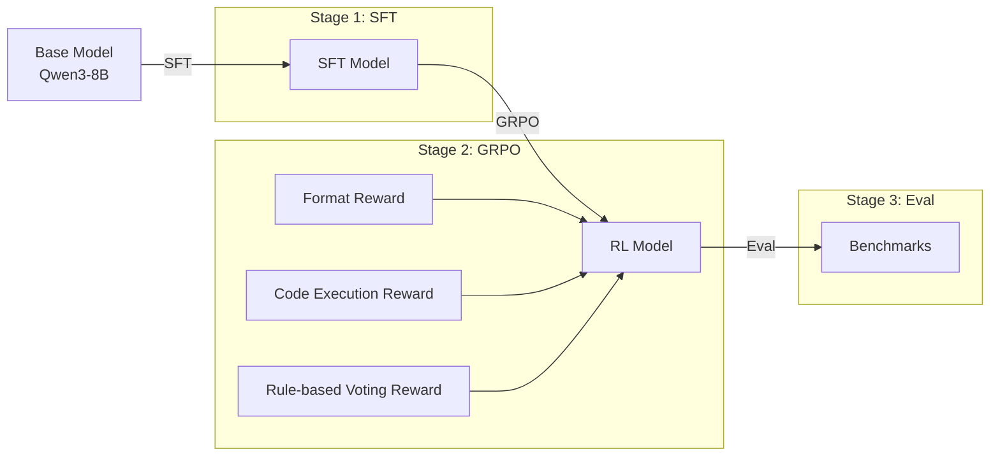

<p align="center">
  <h1 align="center">OR-SR1</h1>
  <p align="center">
    <b>Unsupervised Reasoning for Operations Research with LLMs</b>
  </p>
  <p align="center">
    Training LLMs to solve OR problems through structured thinking, mathematical modeling, and code generation.
  </p>
  <p align="center">
    <a href="#quick-start"></a>
    <a href="#training-pipeline"></a>
    <a href="#evaluation"></a>
  </p>
</p>

<p align="center">
  
  
  
  
</p>

---

## Overview

OR-SR1 trains large language models to solve Operations Research problems end-to-end. Given a natural language problem description, the model produces:

1. **`<thinking>`** — Step-by-step reasoning and analysis
2. **`<model>`** — Formal mathematical formulation (variables, objective, constraints)
3. **`<code>`** — Executable Python code using the COPT solver

## Training Pipeline



### Reward Design (GRPO)

| Reward | Weight | Description |
|--------|--------|-------------|
| **Format** | 1/3 | Checks `<thinking>/<model>/<code>` structure |
| **Code Execution** | 1/3 | Verifies code runs and produces valid output |
| **Rule-based Voting** | 1/3 | Domain-specific checks (MaxFlow, TSP, Integer constraints, Cloze) |

## Project Structure

```
OR-SR1/
├── configs/                # DeepSpeed configs (ZeRO-2/3)
│   ├── sft_config.json
│   ├── grpo_config.json
│   └── dpo_config.json
│
├── src/                    # Core training code
│   ├── 01_sft_train.py     # Supervised fine-tuning
│   ├── 02_grpo_train.py    # Group Relative Policy Optimization
│   ├── dpo_train.py        # Direct Preference Optimization
│   ├── rewards.py          # LLM-judge reward functions
│   ├── rewards_rule_vote.py # Rule-based voting rewards
│   └── utils/              # Data loading & arguments
│
├── scripts/                # Launch scripts
│   ├── 01_sft_train.sh
│   ├── 02_grpo_train.sh
│   └── ...
│
├── eval/                   # Evaluation & benchmarking
├── data_processing/        # Data processing & enrichment
├── tools/                  # Auxiliary utilities
└── datasets/
    └── sft/                # SFT training data
```

## Quick Start

### Prerequisites

```bash
pip install torch transformers trl peft deepspeed datasets wandb
```

### 1. SFT Training

Fine-tune a base model on OR instruction data:

```bash
bash scripts/01_sft_train.sh
```

### 2. GRPO Training

Reinforcement learning with rule-based rewards:

```bash
bash scripts/02_grpo_train.sh
```

### 3. Evaluation

```bash
bash scripts/04_eval.sh <MODEL_PATH> <NUM_GPUS>
```

## Evaluation

Evaluated on **8 OR benchmarks** covering diverse optimization problem types:

| Benchmark | Domain |
|-----------|--------|
| **NL4OPT** | Natural language to optimization |
| **MAMO EasyLP** | Easy linear programming |
| **MAMO ComplexLP** | Complex linear programming |
| **IndustryOR** | Industrial OR problems |
| **ComplexOR** | Complex optimization |
| **NLP4LP** | NLP for linear programming |
| **OptiBench** | Optimization benchmark |
| **OptMath** | Optimization + mathematics |

## Model Output Format

```
<thinking>
Analyze the problem: identify decision variables, objective, and constraints...
</thinking>

<model>
Decision Variables: x_i = ...
Objective: Minimize/Maximize ...
Constraints: ...
</model>

<code>
import coptpy as cp
from coptpy import COPT

env = cp.Envr()
model = env.createModel("problem")
# ... complete solver code
</code>
```
